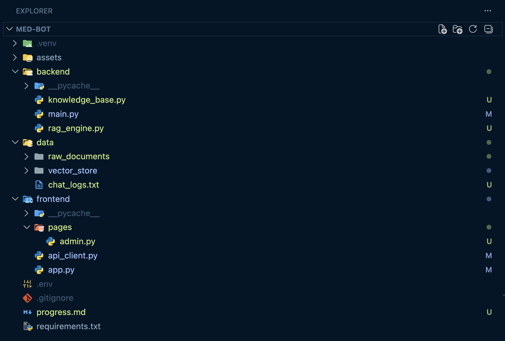
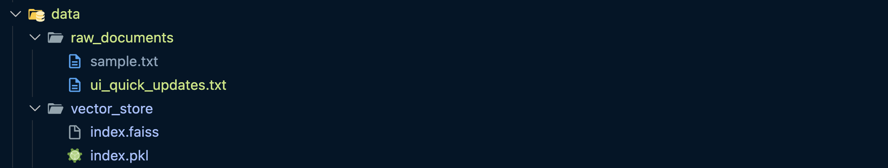
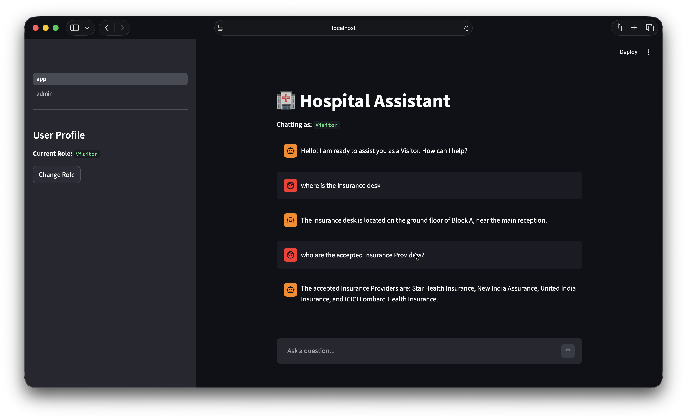
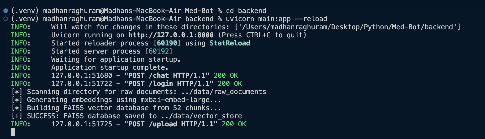
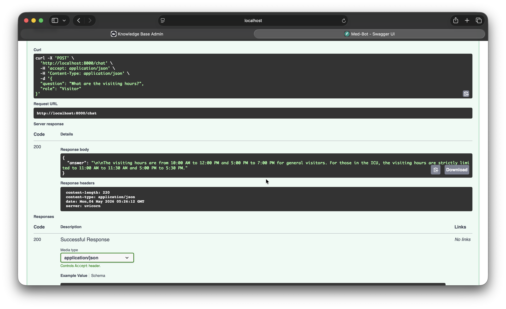

**Project Code:** PRJ-002

**Domain:** GenAI

## Week 1:

### 1. Implementation Plan:

#### Tech Stack: FastAPI, LangChain, Streamlit, FAISS, Ollama (DeepSeek-R1, mxbai-embed-large)
* **Project Architecture Established:** Successfully decoupled the application into a `backend/` and `frontend/` directory structure.

* **Document Parsing Pipeline:** Built `rag_pipeline.py` using LangChain. Implemented `TextLoader` and `PyPDFLoader` to read raw documents.
* **Local Knowledge Base:** Configured a local FAISS vector database. Integrated Ollama with the `mxbai-embed-large` embedding model to accurately convert text chunks into searchable vectors.

* **API Backend:** Developed a FastAPI application `main.py` 
* **Basic Chat Interface:** Created `app.py` using Streamlit.

### 2. Testing Plan:
* **Data Ingestion Testing:** Verified via terminal logs that raw text files are correctly split into logical chunks before embedding.

* **API Testing:** Utilized FastAPI's built-in Swagger UI (`/docs`) to test the POST endpoints.

* **End-to-End RAG Flow:** Successfully queried the Streamlit UI with sample questions. Verified that the `deepseek-r1:7b` model accurately retrieved the information from the FAISS database and formatted a correct, human-readable response.

